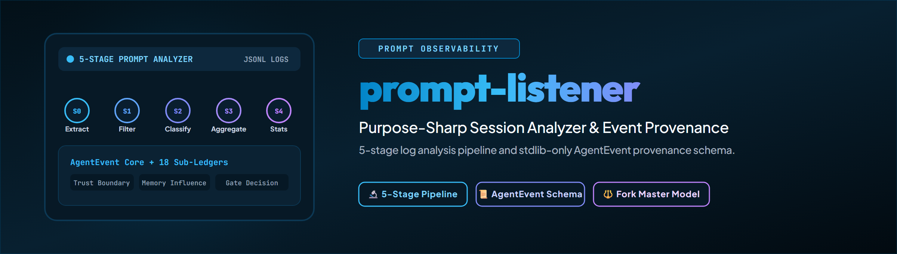

# prompt-listener

> **A purpose-sharp functional unit — like a cell.** Its one purpose: collect
> and evaluate prompts from agent sessions, and hand the data to any consumer
> (workflow analysis, activity patterns, user models, race evaluation). Well
> suited as an **import** (whole or partial, as a data supplier) — and, when
> your purpose truly diverges out of this unit, as a **fork master**: fork,
> diverge deliberately, register your fork in FORKS.md.

[Deutsche Fassung](README_de.md)

## What it is

Two building blocks for prompt/session research, stdlib-only at the core:

1. **`prompt_analyzer.py`** — a 5-stage pipeline over agent session logs
   (JSONL): raw extraction → topic filter → LLM classification
   (type/topic/purpose/intent/method) → per-unit aggregation → statistics.
   Stages 0–1 run with no dependencies (`--dry-run`); stages 2–4 use an LLM
   runner as an **optional neighbour** (detected, never assumed).
2. **`schema/agent_event_v2.py`** — an 850-line, stdlib-only provenance schema
   (AgentEvent core + 18 sub-ledgers: source, authority, trust boundary,
   tool/MCP context, memory influence, planned vs. executed action, gate
   decision, review status) plus JSON Schema and tests. Useful on its own
   wherever "who caused what on which authority" must be recorded.

## The template model

This repo answers a real governance question: *what if a consumer needs the
logic differently?* Then a shared import is the wrong tool — **fork the master
instead**:

- The **master** is versioned, tested and kept tidy.
- A **fork** diverges freely and is *not* chased by master updates.
- The only duty: one line in [`FORKS.md`](FORKS.md) (where, when, why the
  purpose diverged). An audit reads that as *declared divergence* instead of a
  silent copy.

The full ladder: **full import** (identical purpose) → **partial import** (use
only the parts you need — legitimate as long as the *functional unit* fits;
capsules should be built broad and partially consumable for exactly this) →
**fork** (only when the purpose truly diverges out of the functional unit).
Partial use is never a reason to fork.

## Quick start

```bash
python prompt_analyzer.py session.jsonl --dry-run          # stages 0–1, no deps
python prompt_analyzer.py session.jsonl --dry-run --agent-events-output out/events.jsonl
python -m pytest -q                                        # 14 tests
```

## Provenance

Extracted 2026-08-16 from the AI-LAB research project (which keeps the corpora
and results privately and continues as the research working copy — fork #2 in
the register). First registered fork: TOM-lm's `corpus_extract.py`
(user-model building). Method paper: "Prompt-Archaeology" (research line).

## Deliberate non-capabilities (the safety side of staying lean)

This master is kept lean **on purpose** — limits are features:

- Reads **recorded session logs only** (JSONL files handed to it, post-hoc).
  It cannot and shall not read live activity, monitor sessions, or track users.
- No network, no credentials for stages 0–1; classification (2–4) only via an
  explicitly provided runner.
- **Additions that would widen the abuse surface will not be merged into this
  master.** If your import purpose needs such an additive, build it inside
  *your* consuming module, or fork (FORKS.md) and adapt — in a fork, possibly a
  private one, the sensitive capability stays isolated instead of becoming a
  building block anyone can lift out of a public master.

## License

MIT.
