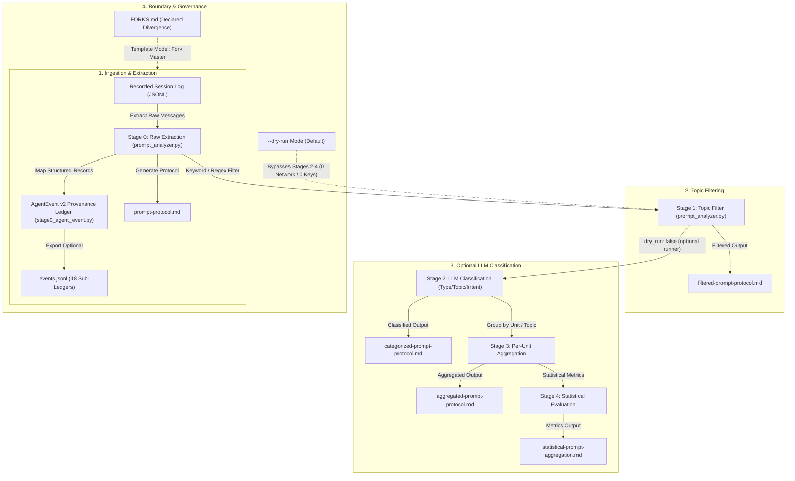
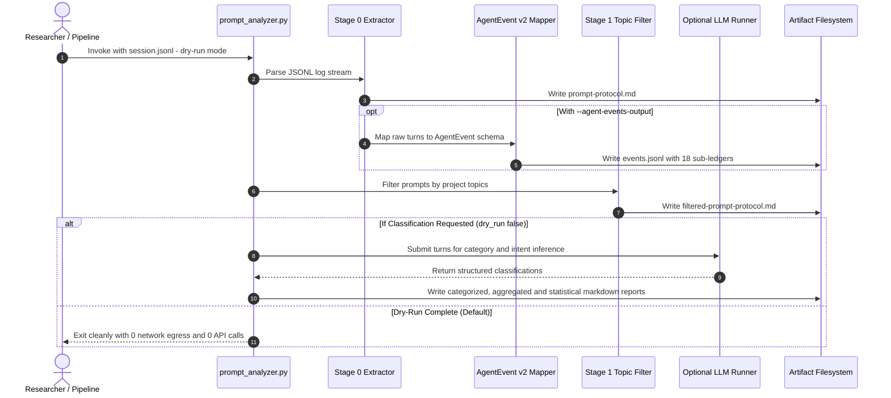

# prompt-listener

> **A purpose-sharp functional unit — like a cell.** Its one purpose: collect
> and evaluate prompts from agent sessions, and hand the data to any consumer
> (workflow analysis, activity patterns, user models, race evaluation). Well
> suited as an **import** (whole or partial, as a data supplier) — and, when
> your purpose truly diverges out of this unit, as a **fork master**: fork,
> diverge deliberately, register your fork in FORKS.md.

[Deutsche Fassung](README_de.md)

[](https://www.python.org/)
[](LICENSE)
[](tests/)
[-success.svg)](SECURITY.md)
[](schema/agent_event_v2.py)
[](FORKS.md)

---

## Quick Navigation

- [What it is](#what-it-is)
- [Architecture & Pipeline Stages](#architecture--pipeline-stages)
- [Execution Flow](#execution-flow)
- [The Template & Cell Model](#the-template--cell-model)
- [Target Personas & Discoverability](#target-personas--discoverability)
- [Comparative Matrix vs. Alternatives](#comparative-matrix-vs-alternatives)
- [Quick Start](#quick-start)
- [Output Artifacts](#output-artifacts)
- [Provenance](#provenance)
- [Deliberate Non-Capabilities](#deliberate-non-capabilities)
- [Governance & Runtime Invariants](#governance--runtime-invariants)
- [License & Security](#license--security)

---

## What it is

Two building blocks for prompt and session interaction research, standard-library-only at the core:

1. **`prompt_analyzer.py`** — a 5-stage pipeline over agent session logs (JSONL): raw extraction → topic filter → LLM classification (type/topic/purpose/intent/method) → per-unit aggregation → statistics. Stages 0–1 run with zero external dependencies (`--dry-run`); stages 2–4 use an LLM runner as an **optional neighbour** (detected dynamically, never required).
2. **`schema/agent_event_v2.py`** — an 850-line, stdlib-only provenance schema (`AgentEvent` core + 18 sub-ledgers: source, authority, trust boundary, tool/MCP context, memory influence, planned vs. executed action, gate decision, review status) plus JSON Schema and automated validation. Useful standalone wherever *"who caused what on which authority"* must be recorded.

---

## Architecture & Pipeline Stages

The evaluation pipeline is strictly decoupled into distinct functional tiers. The core ingestion and provenance ledgers run completely offline, while classification layers interface with optional local or API runners.



### Detailed Pipeline Breakdown
- **Stage 0 (Raw Extraction):** Reads JSONL logs, filters human, assistant, and tool messages, extracts token/word counts, and maps structured events to `AgentEvent v2`. Outputs `prompt-protocol.md` and optional `events.jsonl`.
- **Stage 1 (Topic Filtering):** Applies regex and keyword filtering across project topics (e.g. `Regress`, `V1`, `V2`, `CORE`) without calling language models. Outputs `filtered-prompt-protocol.md`.
- **Stage 2 (Classification):** Categorizes prompts into canonical codes (`SP`: Startprompt, `NT`: Nachfrage-Thema, `NM`: Nachfrage-Methode, `NS`: Nachfrage-Steuerung, `KO`: Korrektur, `BE`: Bestätigung, `RA`: Richtungsänderung, `MP`: Meta-Prompt), detects turning points (`is_turning_point`), and extracts user intent. Outputs `categorized-prompt-protocol.md`.
- **Stage 3 (Per-Unit Aggregation):** Groups turns chronologically and contextually per unit/session topic. Outputs `aggregated-prompt-protocol.md`.
- **Stage 4 (Statistical Evaluation):** Generates distribution metrics, word count variances, prompt efficiency scores, and turning-point density ratios. Outputs `statistical-prompt-aggregation.md`.

---

## Execution Flow

The sequence diagram below illustrates the end-to-end execution flow during a post-hoc analysis session.



---

## The Template & Cell Model

This repo answers a real governance question: *what if a consumer needs the logic differently?* Then a shared import is the wrong tool — **fork the master instead**:

- The **master** is versioned, tested and kept tidy.
- A **fork** diverges freely and is *not* chased by master updates.
- The only duty: one line in [`FORKS.md`](FORKS.md) (where, when, why the purpose diverged). An audit reads that as *declared divergence* instead of a silent copy.

The full ladder: **full import** (identical purpose) → **partial import** (use only the parts you need — legitimate as long as the *functional unit* fits; capsules should be built broad and partially consumable for exactly this) → **fork** (only when the purpose truly diverges out of the functional unit). Partial use is never a reason to fork.

---

## Target Personas & Discoverability

`prompt-listener` is built for research and engineering teams requiring transparent, offline session analysis:

| Persona ID | Target Persona | Primary Use Case & Key Benefit |
|---|---|---|
| **`[PERSONA-01]`** | **AI Interaction & Prompt Researchers** | Analyzes prompt progression, turning points, user intervention patterns, and prompt archaeology across multi-turn sessions. |
| **`[PERSONA-02]`** | **Autonomous Agent & Swarm Engineers** | Needs deterministic provenance tracking via `AgentEvent v2` to record authority chains, trust boundaries, tool/MCP calls, and gate decisions. |
| **`[PERSONA-03]`** | **Security, Compliance & Governance Auditors** | Conducts post-hoc log audits with zero background telemetry daemons, 100% offline data privacy, and verifiable audit ledgers. |
| **`[PERSONA-04]`** | **Local-First & Privacy-Conscious Tool Builders** | Demands standard-library-only parsing units with zero runtime bloat, zero network egress by default, and isolated fork capabilities. |

### High-Intent Search & SEO Keywords
`prompt analysis pipeline`, `agent session log parser`, `AgentEvent provenance schema`, `prompt archaeology`, `post-hoc session audit`, `local-first agent evaluation`, `zero-egress prompt analyzer`, `human-AI interaction metrics`, `prompt classification pipeline`, `audit trail for LLM agents`.

---

## Comparative Matrix vs. Alternatives

| Dimension | `prompt-listener` | Live Telemetry Daemons | Cloud Tracing (Langfuse / Phoenix) | Ad-Hoc Grep / Bash Scripts | Generic OpenTelemetry |
|---|---|---|---|---|---|
| **Data Privacy & Network** (`INV-LOCAL-01`) | **100% Offline (Zero Egress)** | Continuous Background Egress | Cloud API Required | Local Only | Network Export Dependent |
| **Operational Mode** (`INV-POSTHOC-02`) | **Post-Hoc Static Logs Only** | Live Process Hooking | Live Interceptor | Post-Hoc Text Search | Live Event Streaming |
| **Runtime Dependencies** (`INV-DEPEND-03`) | **Python Stdlib Only (0 Deps)** | Native Hooks & Daemons | Heavy SDK Dependencies | Shell Utilities | Complex OTEL Packages |
| **Provenance Ledger** (`INV-SCHEMA-04`) | **AgentEvent v2 (18 Sub-Ledgers)** | Basic Metrics / Traces | Span Trees & Spans | Unstructured Plaintext | Standard Distributed Spans |
| **Multi-Stage Processing** (`INV-PIPELINE-05`) | **5 Distinct Tiers (0–4)** | Flat Metric Stream | Tracing Spans Only | Single-Pass Regex | Event Bus Pipeline |
| **Architecture Model** (`INV-TEMPLATE-06`) | **Fork-Master & Cell Model** | Centralized Service | SaaS Platform / Self-Host | Fragile Ad-hoc Scripts | Shared Library |
| **Capability Isolation** (`INV-PRIVACY-07`) | **Sensitive Surface Isolated** | Expands Attack Surface | External Data Storage | Minimal / Script Local | Broad Agent Permissions |
| **Prompt Archaeology** (`INV-METRICS-08`) | **Native Turning Points & Types** | Not Supported | Generic Token Counts | Manual Expression Matching | Not Supported |
| **Output Formats** (`INV-FORMAT-09`) | **Dual (Markdown + JSONL)** | Dashboards / Time Series | Web UI & Cloud Storage | Terminal stdout | Collector Ingestion |
| **Security SLA** (`INV-SLA-10`) | **Documented 48h SLA** | Proprietary | Vendor Dependent | None | Community Dependent |

---

## Quick Start

### Installation & Prerequisites
Core functionality requires only Python 3.10+ and the standard library:

```bash
git clone https://github.com/ellmos-ai/prompt-listener.git
cd prompt-listener
```

### Running the Pipeline
```bash
# 1. Dependency-free extraction & topic filtering (Stages 0–1, zero egress)
python prompt_analyzer.py session.jsonl --dry-run

# 2. Extract with structured AgentEvent v2 JSONL export
python prompt_analyzer.py session.jsonl --dry-run --agent-events-output out/events.jsonl

# 3. Filter specific research topics
python prompt_analyzer.py session.jsonl --topics "V1,V2,Regress,CORE" --dry-run

# 4. Optional full classification (Stages 2–4 with configured LLM runner)
python prompt_analyzer.py session.jsonl --project regress

# 5. Run the contract and regression test suite
python -m pytest -ra -v
```

---

## Output Artifacts

Running `prompt_analyzer.py` generates structured artifacts in the specified output directory:

| Artifact File | Pipeline Stage | Description |
|---|---|---|
| `prompt-protocol.md` | **Stage 0 (Raw)** | Complete raw turn protocol with timestamp, sender, word count, and agent tags. |
| `events.jsonl` | **Stage 0 (Ledger)** | Machine-readable `AgentEvent v2` stream with 18 sub-ledgers. |
| `filtered-prompt-protocol.md` | **Stage 1 (Filter)** | Turn protocol filtered by topic keywords and regex patterns. |
| `categorized-prompt-protocol.md` | **Stage 2 (Classify)** | Turn protocol classified by type (`SP`, `NT`, `NM`, `NS`, `KO`, `BE`, `RA`, `MP`), intent, and turning points. |
| `aggregated-prompt-protocol.md` | **Stage 3 (Aggregate)** | Turn data grouped by session unit, purpose, and sequence. |
| `statistical-prompt-aggregation.md` | **Stage 4 (Stats)** | Quantitative metrics, word count distribution, and steering efficiency scores. |

---

## Provenance

Extracted 2026-08-16 from the AI-LAB research project (which keeps the corpora and results privately and continues as the research working copy — fork #2 in the register). First registered fork: TOM-lm's `corpus_extract.py` (user-model building). Method paper: *"Prompt-Archaeology"* (research line).

---

## Deliberate Non-Capabilities

This master is kept lean **on purpose** — limits are features:

- Reads **recorded session logs only** (JSONL files handed to it, post-hoc). It cannot and shall not read live activity, monitor sessions, or track users.
- No network, no credentials for stages 0–1; classification (2–4) only via an explicitly provided runner.
- **Additions that would widen the abuse surface will not be merged into this master.** If your import purpose needs such an additive, build it inside *your* consuming module, or fork ([`FORKS.md`](FORKS.md)) and adapt — in a fork, possibly a private one, the sensitive capability stays isolated instead of becoming a building block anyone can lift out of a public master.

---

## Governance & Runtime Invariants

The repository enforces 10 technical invariants verified by automated contract tests:

- **Zero-Copyleft Guarantee:** 100% permissive dependencies (PSF-2.0, MIT, Apache-2.0).
- **RunAsInvoker:** Operates unprivileged in user space without elevation.
- **Comprehensive Audit:** See [`THIRD_PARTY_LICENSES.md`](THIRD_PARTY_LICENSES.md) for full SPDX inventory and governance details.
- **Security SLA:** Documented 48h response SLA in [`SECURITY.md`](SECURITY.md).

---

## License & Security

- **License:** MIT License. See [`LICENSE`](LICENSE) for terms.
- **Security:** Please report security vulnerabilities privately via [GitHub Security Advisories](https://github.com/ellmos-ai/prompt-listener/security/advisories) or `security@open-bricks.org`. See [`SECURITY.md`](SECURITY.md) for reporting guidelines.
- **Statutory Notice (§ 521 BGB):** This open-source software is provided free of charge. Under German statutory law (§ 521 BGB), liability of the author is limited to intent and gross negligence.
