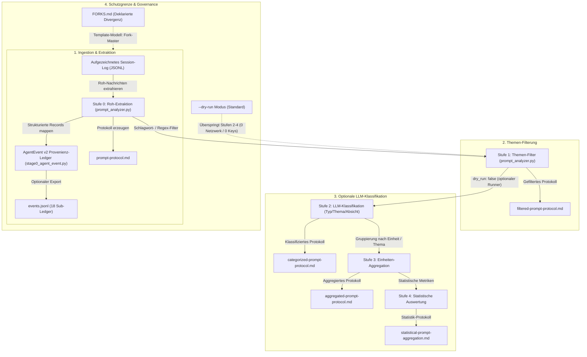
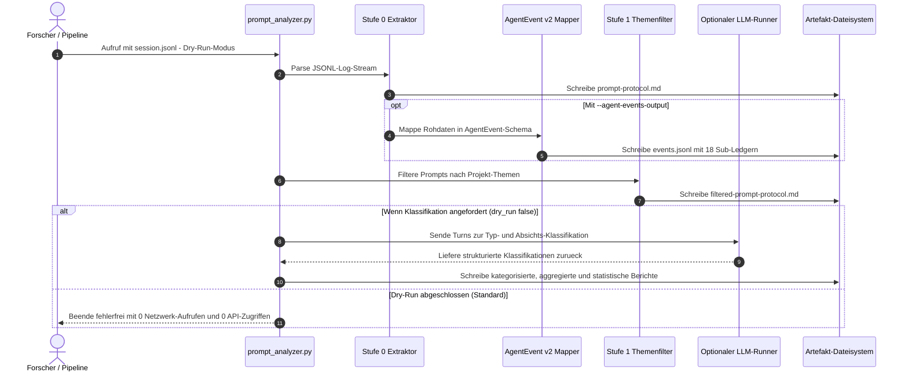

# prompt-listener

> **Eine zweck-scharfe funktionale Einheit — wie eine Zelle.** Ein einziger
> Zweck: Prompts aus Agenten-Sessions sammeln und auswerten, und die Daten an
> beliebige Abnehmer übergeben (Workflow-Analyse, Aktivitätsmuster,
> Nutzermodelle, Race-Evaluation). Eignet sich gut als **Import** (ganz oder in
> Teilen als Datenlieferant) — und, wenn der Zweck wirklich aus der Einheit
> herausdivergiert, als **Fork-Master**: forken, bewusst divergieren, Fork in
> FORKS.md eintragen.

[English Version](README.md)

[](https://www.python.org/)
[](LICENSE)
[](tests/)
[-success.svg)](SECURITY.md)
[](schema/agent_event_v2.py)
[](FORKS.md)

---

## Schnellnavigation

- [Was es ist](#was-es-ist)
- [Architektur & Pipeline-Stufen](#architektur--pipeline-stufen)
- [Ablauf-Sequenz](#ablauf-sequenz)
- [Das Template- & Zell-Modell](#das-template---zell-modell)
- [Zielgruppen & Auffindbarkeit](#zielgruppen--auffindbarkeit)
- [Vergleichsmatrix gegenüber Alternativen](#vergleichsmatrix-gegenüber-alternativen)
- [Schnellstart](#schnellstart)
- [Ausgabe-Artefakte](#ausgabe-artefakte)
- [Provenienz](#provenienz)
- [Bewusste Nicht-Fähigkeiten](#bewusste-nicht-fähigkeiten)
- [Governance- & Laufzeit-Invarianten](#governance---laufzeit-invarianten)
- [Lizenz & Sicherheit](#lizenz--sicherheit)

---

## Was es ist

Zwei Bausteine für Prompt- und Interaktionsforschung an Agenten-Sessions, im Kern ausschließlich auf der Python-Standardbibliothek basierend:

1. **`prompt_analyzer.py`** — eine 5-Stufen-Pipeline über Agenten-Session-Logs (JSONL): Rohdaten-Extraktion → Themenfilterung → LLM-Klassifikation (Typ/Thema/Zweck/Absicht/Methode) → Einheiten-Aggregation → Statistik. Stufen 0–1 laufen völlig ohne externe Abhängigkeiten (`--dry-run`); Stufen 2–4 nutzen einen LLM-Runner als **optionalen Nachbarn** (dynamisch erkannt, nie vorausgesetzt).
2. **`schema/agent_event_v2.py`** — ein 850 Zeilen langes, rein auf Standard-Bibliothek basierendes Provenienz-Schema (`AgentEvent`-Kern + 18 Sub-Ledger: Quelle, Autorität, Vertrauensgrenze, Tool/MCP-Kontext, Gedächtniseinfluss, geplante vs. ausgeführte Aktion, Gate-Entscheidung, Review-Status) inklusive JSON-Schema und automatisierten Tests. Eigenständig überall dort nützlich, wo *"wer hat was auf welcher Autorität bewirkt"* nachvollziehbar dokumentiert werden muss.

---

## Architektur & Pipeline-Stufen

Die Analyse-Pipeline ist strikt in funktionale Ebenen getrennt. Kern-Ingestion und Provenienz-Erfassung arbeiten vollständig offline, während Klassifikationsstufen optionale lokale oder API-Runner anbinden können.



### Detaillierte Pipeline-Aufteilung
- **Stufe 0 (Rohdaten-Extraktion):** Liest JSONL-Logs, trennt Human-, Assistant- und Tool-Nachrichten, erfasst Wortzahlen und mappt strukturierte Ereignisse deterministisch in das `AgentEvent v2`-Ledger. Erzeugt `prompt-protocol.md` und optional `events.jsonl`.
- **Stufe 1 (Themen-Filterung):** Wendet reguläre Ausdrücke und Schlüsselwort-Filter über Projekt-Themen (z. B. `Regress`, `V1`, `V2`, `CORE`) an, ohne Sprachmodelle aufzurufen. Erzeugt `filtered-prompt-protocol.md`.
- **Stufe 2 (LLM-Klassifikation):** Klassifiziert Prompts nach kanonischen Codes (`SP`: Startprompt, `NT`: Nachfrage-Thema, `NM`: Nachfrage-Methode, `NS`: Nachfrage-Steuerung, `KO`: Korrektur, `BE`: Bestätigung, `RA`: Richtungsänderung, `MP`: Meta-Prompt), erkennt Wendepunkte (`is_turning_point`) und extrahiert die Steuerungsabsicht. Erzeugt `categorized-prompt-protocol.md`.
- **Stufe 3 (Einheiten-Aggregation):** Gruppiert Interaktionsschritte chronologisch und thematisch pro Session-Einheit. Erzeugt `aggregated-prompt-protocol.md`.
- **Stufe 4 (Statistische Auswertung):** Berechnet Verteilungsmetriken, Wortanzahl-Varianzen, Prompt-Effizienzwerte und Wendepunktdichten. Erzeugt `statistical-prompt-aggregation.md`.

---

## Ablauf-Sequenz

Das folgende Sequenzdiagramm veranschaulicht den End-to-End-Ablauf einer Post-Hoc-Analysesitzung.



---

## Das Template- & Zell-Modell

Dieses Repo beantwortet eine praktische Frage der Modul-Architektur: *Was, wenn ein Abnehmer die Logik anders braucht?* Dann ist ein geteilter Import das falsche Werkzeug — **forke stattdessen den Master**:

- Der **Master** wird versioniert, getestet und sauber gehalten.
- Ein **Fork** divergiert frei und wird vom Master *nicht* nachgezogen.
- Die einzige Pflicht: eine Zeile in [`FORKS.md`](FORKS.md) (Ort, Datum, ein Satz Zweck-Divergenz). Ein Audit liest das als *deklarierte Divergenz* statt als stille Kopie.

Die volle Stufenleiter: **Vollimport** (identischer Zweck) → **Teilimport** (nur die Teile nutzen, die gebraucht werden — legitim, solange die *funktionale Einheit* passt; Kapseln sollten genau dafür breit und in Teilen konsumierbar gebaut sein) → **Fork** (erst wenn der Zweck wirklich aus der funktionalen Einheit herausdivergiert). Teilnutzung ist niemals ein Grund zum Forken.

---

## Zielgruppen & Auffindbarkeit

`prompt-listener` ist auf Forschungsteams und Software-Architekten ausgelegt, die transparente, offline-fähige Session-Analysen benötigen:

| Zielgruppen-ID | Zielgruppe | Primärer Anwendungsfall & Nutzen |
|---|---|---|
| **`[PERSONA-01]`** | **KI-Interaktions- & Prompt-Forscher** | Untersucht Prompt-Verläufe, Wendepunkte (Turning Points), Steuerungsverhalten und Prompt-Archäologie in komplexen Multi-Turn-Sessions. |
| **`[PERSONA-02]`** | **Autonome Agenten- & Schwarm-Entwickler** | Benötigt deterministisches Provenienz-Tracking via `AgentEvent v2`, um Autoritätsketten, Vertrauensgrenzen, Tool/MCP-Aufrufe und Gate-Entscheidungen zu sichern. |
| **`[PERSONA-03]`** | **Sicherheits-, Compliance- & Governance-Auditoren** | Führt post-hoc Log-Audits durch — ohne Live-Hintergrunddienste, mit 100% lokaler Datenhoheit und verifizierbaren Prüfprotokollen. |
| **`[PERSONA-04]`** | **Local-First & Datenschutz-fokussierte Tool-Entwickler** | Benötigt leichtgewichtige, stdlib-basierte Parser-Einheiten ohne Abhängigkeiten-Ballast, mit standardmäßigem Zero-Network-Egress. |

### Hochrelevante Such- & SEO-Begriffe
`Prompt-Analyse-Pipeline`, `Agenten-Session-Log-Parser`, `AgentEvent-Provenienz-Schema`, `Prompt-Archäologie`, `Post-Hoc-Session-Audit`, `lokale Agenten-Evaluation`, `Zero-Egress Prompt-Analyzer`, `Mensch-KI-Interaktions-Metriken`, `Prompt-Klassifikations-Pipeline`, `Audit-Trail für LLM-Agenten`.

---

## Vergleichsmatrix gegenüber Alternativen

| Dimension | `prompt-listener` | Live-Telemetrie-Daemons | Cloud-Tracing (Langfuse / Phoenix) | Ad-Hoc Grep / Bash-Skripte | Generisches OpenTelemetry |
|---|---|---|---|---|---|
| **Datenschutz & Netzwerk** (`INV-LOCAL-01`) | **100% Offline (Zero Egress)** | Kontinuierlicher Netzwerk-Egress | Cloud-API zwingend erforderlich | Lokal | Netzwerk-Export abhängig |
| **Betriebsmodus** (`INV-POSTHOC-02`) | **Rein statische Post-Hoc Logs** | Live-Prozess-Überwachung | Live-Interceptor / Hook | Post-Hoc Textsuche | Live-Event-Streaming |
| **Laufzeit-Abhängigkeiten** (`INV-DEPEND-03`) | **Nur Python Stdlib (0 Deps)** | Native Hooks & Daemons | Umfangreiche SDK-Abhängigkeiten | Shell-Utilities | Komplexe OTEL-Pakete |
| **Provenienz-Ledger** (`INV-SCHEMA-04`) | **AgentEvent v2 (18 Sub-Ledger)** | Flache Metriken / Traces | Spans & Traces | Unstrukturiertes Plaintext | Generische verteilte Spans |
| **Mehrstufige Pipeline** (`INV-PIPELINE-05`) | **5 distinkte Stufen (0–4)** | Flacher Metrik-Stream | Reine Trace-Spans | Single-Pass Regex | Event-Bus Pipeline |
| **Architekturmodell** (`INV-TEMPLATE-06`) | **Fork-Master & Zellmodell** | Zentralisierter Dienst | SaaS-Plattform / Self-Host | Fragile Ad-hoc Skripte | Geteilte Bibliothek |
| **Fähigkeiten-Isolation** (`INV-PRIVACY-07`) | **Sensible Angriffsfläche isoliert** | Erweitert Angriffsfläche | Externe Datenspeicherung | Minimal / Lokal | Breite Agenten-Rechte |
| **Prompt-Archäologie** (`INV-METRICS-08`) | **Native Wendepunkte & Typen** | Nicht unterstützt | Generische Token-Zählung | Manuelle Regexe | Nicht unterstützt |
| **Ausgabe-Formate** (`INV-FORMAT-09`) | **Dual (Markdown + JSONL)** | Dashboards / Zeitreihen | Web-UI & Cloud-Speicher | Terminal stdout | Collector Ingestion |
| **Sicherheits-SLA** (`INV-SLA-10`) | **Dokumentierte 48h-SLA** | Proprietär | Herstellerabhängig | Keine | Communityabhängig |

---

## Schnellstart

### Installation & Voraussetzungen
Die Kernfunktionen setzen lediglich Python 3.10+ und die Standardbibliothek voraus:

```bash
git clone https://github.com/ellmos-ai/prompt-listener.git
cd prompt-listener
```

### Ausführen der Pipeline
```bash
# 1. Abhängigkeitsfreie Extraktion & Themenfilterung (Stufen 0–1, zero egress)
python prompt_analyzer.py session.jsonl --dry-run

# 2. Extraktion mit strukturiertem AgentEvent v2 JSONL-Export
python prompt_analyzer.py session.jsonl --dry-run --agent-events-output out/events.jsonl

# 3. Spezifische Forschungs-Themen filtern
python prompt_analyzer.py session.jsonl --topics "V1,V2,Regress,CORE" --dry-run

# 4. Optionale Voll-Klassifikation (Stufen 2–4 mit konfiguriertem LLM-Runner)
python prompt_analyzer.py session.jsonl --project regress

# 5. Ausführen der Vertrags- und Regressionstestsuite
python -m pytest -ra -v
```

---

## Ausgabe-Artefakte

Die Ausführung von `prompt_analyzer.py` erzeugt strukturierte Artefakte im Zielverzeichnis:

| Artefakt-Datei | Pipeline-Stufe | Beschreibung |
|---|---|---|
| `prompt-protocol.md` | **Stufe 0 (Roh)** | Vollständiges Turn-Protokoll mit Zeitstempeln, Absender, Wortzahl und Agenten-Tags. |
| `events.jsonl` | **Stufe 0 (Ledger)** | Maschinenlesbarer `AgentEvent v2`-Stream mit 18 Sub-Ledgern. |
| `filtered-prompt-protocol.md` | **Stufe 1 (Filter)** | Turn-Protokoll gefiltert nach Themen-Schlagwörtern und Regex-Mustern. |
| `categorized-prompt-protocol.md` | **Stufe 2 (Klassifikation)** | Turn-Protokoll klassifiziert nach Typ (`SP`, `NT`, `NM`, `NS`, `KO`, `BE`, `RA`, `MP`), Absicht und Wendepunkten. |
| `aggregated-prompt-protocol.md` | **Stufe 3 (Aggregation)** | Turn-Daten gruppiert nach Session-Einheit, Zweck und Verlauf. |
| `statistical-prompt-aggregation.md` | **Stufe 4 (Statistik)** | Quantitative Metriken, Wortanzahl-Verteilungen und Steuerungs-Effizienzwerte. |

---

## Provenienz

Ausgekapselt am 2026-08-16 aus dem Forschungsprojekt AI-LAB (welches die Korpora und Ergebnisse privat hält und als Forschungs-Arbeitskopie weiterläuft — Fork #2 im Register). Erster registrierter Fork: TOM-lms `corpus_extract.py` (Nutzermodell-Bau). Methodenpapier: *"Prompt-Archaeology"* (research-line).

---

## Bewusste Nicht-Fähigkeiten

Dieser Master wird **bewusst** schlank gehalten — Beschränkungen sind Architektur-Features:

- Liest **ausschließlich aufgezeichnete Session-Logs** (ihm übergebene JSONL-Dateien, post-hoc). Es kann und soll keine Live-Aktivitäten überwachen, Sitzungen mitschneiden oder Nutzer tracken.
- Kein Netzwerk, keine Zugangsdaten für die Stufen 0–1; Klassifikation (2–4) erfolgt ausschließlich über einen explizit bereitgestellten Runner.
- **Erweiterungen, die die Angriffsfläche vergrößern, werden nicht in diesen Master aufgenommen.** Braucht ein Abnehmer solche Funktionalitäten, baut er sie im konsumierenden Modul oder forkt ([`FORKS.md`](FORKS.md)) — in einem Fork bleibt die sensible Fähigkeit isoliert, statt zum frei zugänglichen Baustein im öffentlichen Master zu werden.

---

## Governance- & Laufzeit-Invarianten

Das Repository erzwingt 10 technische Invarianten, die durch automatisierte Vertragstests gesichert werden:

- **Zero-Copyleft-Garantie:** 100% freie Lizenzen (PSF-2.0, MIT, Apache-2.0).
- **RunAsInvoker:** Arbeitet unprivilegiert im Benutzerkontext ohne Rechteerweiterung.
- **Umfassendes Lizenz-Audit:** Siehe [`THIRD_PARTY_LICENSES.md`](THIRD_PARTY_LICENSES.md) für die vollständige SPDX-Aufstellung.
- **Sicherheits-SLA:** Verbindliche 48h-Reaktions-SLA in [`SECURITY.md`](SECURITY.md).

---

## Lizenz & Sicherheit

- **Lizenz:** MIT-Lizenz. Siehe [`LICENSE`](LICENSE) für die Lizenzbestimmungen.
- **Sicherheit:** Sicherheitslücken bitte diskret über [GitHub Security Advisories](https://github.com/ellmos-ai/prompt-listener/security/advisories) oder per E-Mail an `security@open-bricks.org` melden. Siehe [`SECURITY.md`](SECURITY.md) für Melderichtlinien.
- **Gesetzlicher Hinweis (§ 521 BGB):** Die Bereitstellung dieser Open-Source-Software erfolgt unentgeltlich. Die Haftung des Autors ist gemäß § 521 BGB auf Vorsatz und grobe Fahrlässigkeit beschränkt.
